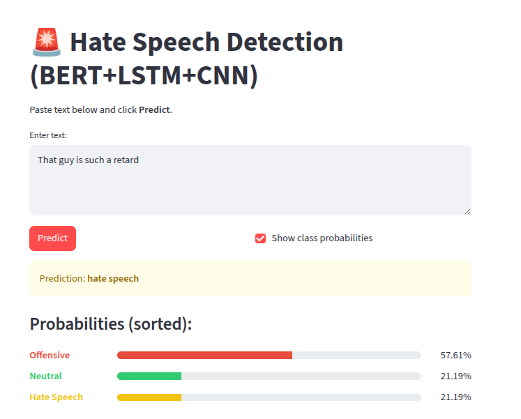
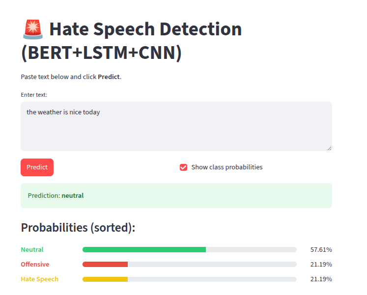

# 🚨 Hate Speech Detection (BERT + CNN + LSTM)

This project implements a **hybrid deep learning model** for detecting hate speech, offensive language, and neutral text in tweets. It combines **BERT embeddings** with **CNN** and **LSTM** layers to achieve high accuracy in text classification.
 **Hosted on:** [Streamlit Cloud](https://hatespeechdetectioncloud-hhnur2gg94gumqxoqqdrqs.streamlit.app/)

## 📌 Features
- Classifies tweets/text into:
  - **Hate Speech**
  - **Offensive Language**
  - **Neutral**
- Hybrid model architecture:
  - **BERT** for embeddings  
  - **CNN** for feature extraction  
  - **LSTM** for sequence learning
- Streamlit Web App for real-time predictions
- Color-coded probability bars for better visualization

## 🗂️ Project Structure
```
HATE_SPEECH_DETECTION-LOCAL/
├── app/
│ ├── pycache/
│ ├── .env
│ ├── .venv/
│ ├── cnn_lstm_hate_speech_bert/
│ ├── hsd_model.py
│ ├── labeled_data.csv
│ ├── requirements.txt
│ └── streamlit_app.py
│
├── assets/
│ ├── hate_speech.png
│ ├── neutral.png
│ └── offensive.png
│
├── docs/
│ ├── certificate.jpeg
│ ├── Code run.mkv
│ ├── Deep Learning for Hate Speech Detection in Tweets Using LSTM ...
│ ├── final_ppt_hate_speech.pptx
│ ├── hate_speech_report_final_2023.pdf
│ └── hate_speech_report_final_2323.docx
│
├── Notebook/
│ ├── bert_lstm_cnn_test.ipynb
│ └── bert_lstm_cnn.ipynb
└── README.md
```

⚠️ **Note**: The trained model (`cnn_lstm_hate_speech_bert/`) is too large for GitHub (>100MB). It is excluded via `.gitignore`. You must download or export your own SavedModel.
## 📸 Screenshots  

### Hate  
  

### Neutral  
  

### Offensive
  
## 🚀 Installation

1. Clone the repo:
   ```bash
   git clone https://github.com/ArponRoy7/Hate_speech_detection.git
   cd Hate_speech_detection
   ```

2. Create & activate a virtual environment:
   ```bash
   python -m venv .venv
   source .venv/bin/activate   # Linux/Mac
   .venv\Scripts\activate      # Windows
   ```

3. Install dependencies:
   ```bash
   pip install -r requirements.txt
   ```

   Ensure TensorFlow and TensorFlow-Text match:
   ```bash
   pip install "tensorflow==2.19.0" "tensorflow-text==2.19.0"
   ```

4. Place your trained model inside the project root:
   ```
   cnn_lstm_hate_speech_bert/
   ├── saved_model.pb
   └── variables/
   ```

## ▶️ Running the App
Start the Streamlit app:
```bash
streamlit run streamlit_app.py
```

## 📝 Example Predictions
- Input: *"Who tf is this faggot"*  
  → **Hate Speech** 🟨  
- Input: *"One fly ass bitch"*  
  → **Offensive** 🟥  
- Input: *"Harry Styles is so hot"*  
  → **Neutral** 🟩  

## 📊 Dataset
- Davidson et al. — *Hate Speech and Offensive Language*  
- Basile et al. — *Hate and Not Hate*  
- Zampieri et al. — *Offensive and Not Offensive*  

Final merged dataset: **34,896 tweets**  
Labels: `0=Hate Speech, 1=Offensive, 2=Neutral`  

## 📈 Performance
- Training & validation accuracy plotted over epochs
- Confusion matrix on test data
- Hybrid BERT + CNN + LSTM shows superior performance compared to standalone CNN, LSTM, Bi-LSTM

## 👩‍🏫 Mentor
- Mrs. Monika Singh, Assistant Professor, RCCIIT

## 👨‍💻 Authors
- Ashif Mondal  
- Diya Neogi  
- **Arpon Roy**  
- Bidisha Saha  
